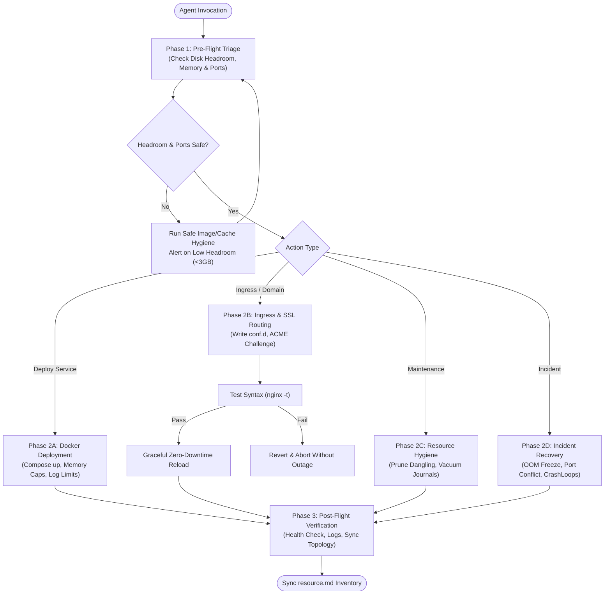

# 🛠️ Agent DevOps Manager

[](LICENSE)
[](references/safety-guardrails-and-audit.md)
[](#installation--adapters)
[](references/docker-and-container-orchestration.md)
[](references/reverse-proxy-and-ssl.md)

An enterprise-grade, defensive **DevOps & SRE operational engine** designed for autonomous AI agents and engineering teams managing remote Linux servers, Dockerized microservice fleets, ingress reverse proxies, and observability pipelines.

Equips agents with the discipline, muscle memory, and safety guardrails of a **Senior Systems / Platform Engineer** (5–8+ years production experience).

---

## 🧭 Operational Architecture & Decision Pipeline

Every interaction with managed infrastructure follows a rigorous, non-destructive three-phase lifecycle:



---

## 🌟 Core Capabilities & Senior SRE Hallmarks

### 1. Defensive Operations & Pre-Flight Discipline
- **Mandatory Headroom Checks**: Always inspects root partition free space (`df -h /`) before compiling images or pulling layers. Halts if free space is below **3.0 GB**.
- **Dry-Run Syntax Testing**: Never reloads web servers blindly. Executes `docker exec nginx-proxy nginx -t` before issuing `nginx -s reload`.

### 2. Strict Container-Only Workload Standards
- **Zero Bare-Metal Daemons**: Prohibits untracked `nohup`, `screen`, `tmux`, or manual runtime commands directly on host.
- **Resource Containment**: Every service definition requires explicit `mem_limit` and `restart: unless-stopped`.
- **Log Rotation Enforcement**: Protects small root partitions by mandating standard Docker `json-file` log caps (`max-size: 10m`, `max-file: 3`).

### 3. Edge Ingress & SSL/TLS Automation
- **Containerized Nginx Gateway**: Centralizes public HTTP (`80`) and HTTPS (`443`) routing.
- **Virtual Host Isolation**: Modular site configurations in `conf.d/<site>.conf`.
- **Let's Encrypt / Certbot Synchronization**: Automatic ACME HTTP-01 webroot challenge routing.
- **Edge CDN Alignment**: Proper edge-to-origin TLS configuration (ArvanCloud / Cloudflare) and real client IP forwarding.

### 4. Full Observability & UI Tunneling
- **Least-Privilege Admin Access**: Keeps management dashboards (Dockhand, Prometheus, Grafana) bound to loopback or private networks.
- **Encrypted Port Forwarding**: Uses automated SSH tunnels (`scripts/server-ssh-tunnel.ps1`) for secure local browser inspection (`http://localhost:8008`).

### 5. Production Incident Playbooks
- Codified emergency remediation workflows for:
  - **OOM Freezes & Swap Thrashing**
  - **Disk Full ("No space left on device") Emergencies**
  - **502 Bad Gateway / Ingress Failures**
  - **Container CrashLoops (Exit Code 137 / Exit Code 1)**

---

## 📁 Repository Structure

```text
agent-devops-manager/
├── SKILL.md                          # Master runbook & operational router
├── config.template.json              # Multi-server profile configuration template
├── CONTRIBUTING.md                   # Contribution & playbook submission guide
├── LICENSE                           # MIT License (Amin Fallah)
├── README.md                         # Architecture overview & documentation
├── references/
│   ├── ssh-and-connectivity.md       # Zero-leak SSH, custom ports & UI tunneling
│   ├── docker-and-container-orchestration.md # Compose standards, memory caps, log rotation
│   ├── reverse-proxy-and-ssl.md      # Nginx proxy architecture, conf.d sites, Certbot ACME
│   ├── resource-and-disk-hygiene.md  # Headroom checks, safe prune, journal vacuuming
│   ├── observability-and-health-checks.md # Triage matrix, Dockhand, Prometheus & Grafana
│   ├── incident-playbooks-and-recovery.md # Step-by-step incident response playbooks
│   └── safety-guardrails-and-audit.md # Forbidden commands, pre-flight safety checklist
├── rules/
│   ├── cursor_server_rules.md        # Drop-in .cursorrules snippet for Cursor / Windsurf
│   └── claude_server.md              # Drop-in CLAUDE.md snippet for Claude Code
└── scripts/
    ├── server-health-audit.ps1       # Non-destructive system triage (RAM, Disk, Docker, Ports)
    ├── safe-nginx-reload.ps1         # Pre-flight syntax check ('nginx -t') before zero-downtime reload
    ├── docker-cleanup.ps1            # Safe dangling image and build cache pruning
    └── server-ssh-tunnel.ps1         # Automated SSH port-forwarding for private UIs
```

---

## 🚀 Installation & Adapters

### 1. Google Antigravity (AGY)
Install as a global agent skill:
```bash
# Copy into global Antigravity skills directory
cp -r agent-devops-manager ~/.gemini/config/skills/devops-manager
cp ~/.gemini/config/skills/devops-manager/config.template.json ~/.gemini/config/skills/devops-manager/config.json
```

### 2. Cursor & Windsurf
Add the contents of [`rules/cursor_server_rules.md`](rules/cursor_server_rules.md) to your workspace `.cursorrules` or `.cursor/rules/devops.mdc`.

### 3. Claude Code
Append the rules from [`rules/claude_server.md`](rules/claude_server.md) to your project's root `CLAUDE.md`.

---

## ⚡ Quick Start: Automation Scripts

All helper scripts in `scripts/` are cross-platform and non-destructive:

```powershell
# 1. Run full system health audit (CPU, RAM, Disk Headroom, Docker Containers, Open Ports)
powershell scripts/server-health-audit.ps1

# 2. Test Nginx reverse proxy syntax without modifying runtime
powershell scripts/safe-nginx-reload.ps1 -TestOnly

# 3. Perform zero-downtime graceful Nginx reload
powershell scripts/safe-nginx-reload.ps1

# 4. Safely purge dangling images and build cache without touching volumes
powershell scripts/docker-cleanup.ps1

# 5. Open encrypted SSH tunnel for Dockhand (:8008) and Prometheus (:19090)
powershell scripts/server-ssh-tunnel.ps1
```

---

## ⛔ Forbidden Commands & Safety Guardrails

| Forbidden Action | Risk | Safe Alternative |
| :--- | :--- | :--- |
| `docker system prune -a --volumes` | **Destroys active databases & volumes** | `docker image prune -f` & `docker builder prune -f` |
| `rm -rf /` or wildcard deletion in root dirs | Unrecoverable OS corruption | Target specific named build folders only |
| Bare-metal daemons (`nohup`, `dotnet run`) | Uncapped RAM consumption, OOM freeze | Mandatory Docker Compose with `mem_limit` |
| Blind Nginx reload without `nginx -t` | Syntax errors crash public ingress | Run `safe-nginx-reload.ps1` |

---

## 📄 License

Distributed under the **MIT License**. See [LICENSE](LICENSE) for details.

Authored by **[Amin Fallah](https://github.com/AminFallah4252)**.
