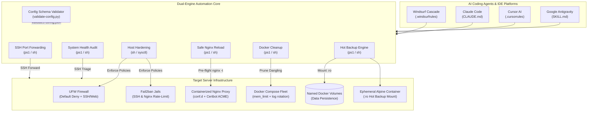
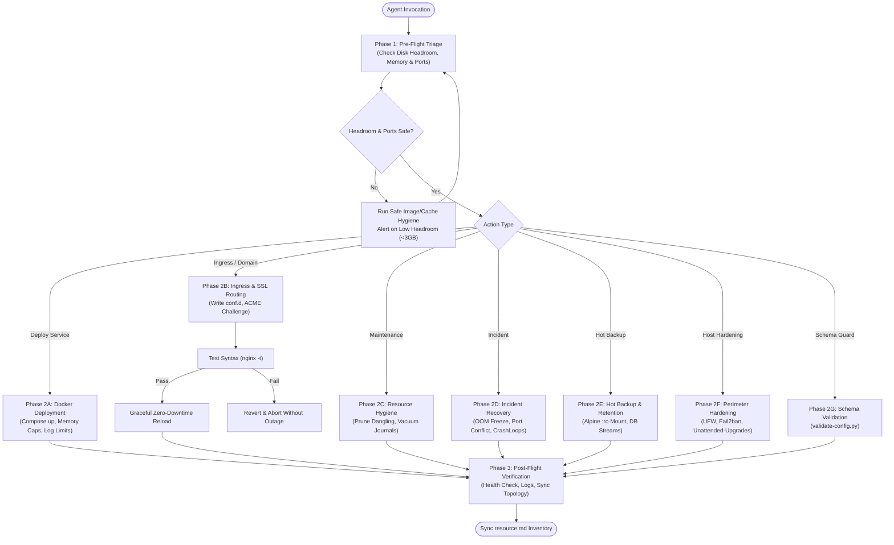

# 🛠️ Agent DevOps Manager

[](https://github.com/AminFallah4252/agent-devops-manager/actions/workflows/ci.yml)
[](#1-powershell-pester-v5-test-suite)
[](#2-posix-bash-test-suite-runner)
[](#4-python-configuration-schema-validation-suite)
[](#3-static-analysis--linting-harness)
[](schemas/config.schema.json)
[](LICENSE)
[](references/safety-guardrails-and-audit.md)

An enterprise-grade, defensive **DevOps & SRE operational engine** designed for autonomous AI agents and engineering teams managing remote Linux servers, Dockerized microservice fleets, ingress reverse proxies, hot disaster recovery pipelines, and observability telemetry.

Equips AI agents with the discipline, muscle memory, and safety guardrails of a **Senior Systems / Platform Engineer** (5–8+ years production experience).

---

## 🧭 System Architecture & Operational Decision Pipeline

The engine enforces a rigorous, non-destructive three-phase lifecycle across all server interactions:


```mermaid
flowchart TD
    subgraph Clients ["AI Coding Agents & IDE Platforms"]
        AGY["Google Antigravity\n(SKILL.md)"]
        Cursor["Cursor AI\n(.cursorrules)"]
        Claude["Claude Code\n(CLAUDE.md)"]
        Windsurf["Windsurf Cascade\n(.windsurfrules)"]
    end

    subgraph Core ["Dual-Engine Automation Core"]
        Audit["System Health Audit\n(ps1 / sh)"]
        Reload["Safe Nginx Reload\n(ps1 / sh)"]
        Cleanup["Docker Cleanup\n(ps1 / sh)"]
        Tunnel["SSH Port Forwarding\n(ps1 / sh)"]
        Backup["Hot Backup Engine\n(ps1 / sh)"]
        Hardening["Host Hardening\n(sh / sysctl)"]
        Validator["Config Schema Validator\n(validate-config.py)"]
    end

    subgraph Host ["Target Server Infrastructure"]
        UFW["UFW Firewall\n(Default Deny + SSH/Web)"]
        F2B["Fail2ban Jails\n(SSH & Nginx Rate-Limit)"]
        Nginx["Containerized Nginx Proxy\n(conf.d + Certbot ACME)"]
        Docker["Docker Compose Fleet\n(mem_limit + log rotation)"]
        Volumes[("Named Docker Volumes\n(Data Persistence)")]
        Alpine["Ephemeral Alpine Container\n(:ro Hot Backup Mount)"]
    end

    AGY & Cursor & Claude & Windsurf --> Core
    Audit -->|SSH Triage| Host
    Reload -->|Pre-flight nginx -t| Nginx
    Cleanup -->|Prune Dangling| Docker
    Tunnel -->|SSH Forward| Host
    Backup -->|Mount :ro| Volumes
    Backup --> Alpine
    Hardening -->|Enforce Policies| UFW & F2B
    Validator -.->|Validates config.json| Core
```

### Three-Phase Operational Lifecycle


```mermaid
flowchart TD
    Start(["Agent Invocation"]) --> PreFlight["Phase 1: Pre-Flight Triage\n(Check Disk Headroom, Memory & Ports)"]
    PreFlight --> CheckOK{"Headroom & Ports Safe?"}
    CheckOK -- No --> Remediate["Run Safe Image/Cache Hygiene\nAlert on Low Headroom (<3GB)"]
    Remediate --> PreFlight
    CheckOK -- Yes --> Action{"Action Type"}
    
    Action -- "Deploy Service" --> DeployFlow["Phase 2A: Docker Deployment\n(Compose up, Memory Caps, Log Limits)"]
    Action -- "Ingress / Domain" --> NginxFlow["Phase 2B: Ingress & SSL Routing\n(Write conf.d, ACME Challenge)"]
    Action -- "Maintenance" --> HygieneFlow["Phase 2C: Resource Hygiene\n(Prune Dangling, Vacuum Journals)"]
    Action -- "Incident" --> IncidentFlow["Phase 2D: Incident Recovery\n(OOM Freeze, Port Conflict, CrashLoops)"]
    Action -- "Hot Backup" --> BackupFlow["Phase 2E: Hot Backup & Retention\n(Alpine :ro Mount, DB Streams)"]
    Action -- "Host Hardening" --> HardeningFlow["Phase 2F: Perimeter Hardening\n(UFW, Fail2ban, Unattended-Upgrades)"]
    Action -- "Schema Guard" --> SchemaFlow["Phase 2G: Schema Validation\n(validate-config.py)"]

    DeployFlow --> PostFlight["Phase 3: Post-Flight Verification\n(Health Check, Logs, Sync Topology)"]
    NginxFlow --> NginxTest["Test Syntax (nginx -t)"]
    NginxTest -- Pass --> ReloadNginx["Graceful Zero-Downtime Reload"]
    NginxTest -- Fail --> Abort["Revert & Abort Without Outage"]
    ReloadNginx --> PostFlight
    HygieneFlow --> PostFlight
    IncidentFlow --> PostFlight
    BackupFlow --> PostFlight
    HardeningFlow --> PostFlight
    SchemaFlow --> PostFlight
    PostFlight --> Finish(["Sync resource.md Inventory"])
```

---

## 🔌 Multi-Platform Adapter Matrix [INV-006]

Agent DevOps Manager ships with native adapter rules and drop-in configurations for all major AI development platforms:

| Platform | Configuration / Adapter Location | Integration Mechanism | Supported Features |
| :--- | :--- | :--- | :--- |
| **Google Antigravity** | [`SKILL.md`](SKILL.md) | Native Antigravity Skill (`devops-manager`) | Complete runbook, SOPs, decision matrix, CLI tools |
| **Cursor AI** | [`rules/cursor_server_rules.md`](rules/cursor_server_rules.md) | `.cursorrules` / `.cursor/rules/devops.mdc` | Dual-engine execution, pre-flight syntax, negative constraints |
| **Claude Code** | [`rules/claude_server.md`](rules/claude_server.md) | `CLAUDE.md` | SRE guidelines, test commands, backup & hardening directives |
| **Windsurf Cascade** | [`rules/windsurf_server_rules.md`](rules/windsurf_server_rules.md) | `.windsurfrules` / `.windsurf/rules/` | Cascade instructions, non-destructive safety, dual parity |

---

## ⚡ Dual-Engine CLI Command Table

Every automation tool provides 100% functional parity between PowerShell 7+ and POSIX Bash:

| Operation | PowerShell 7+ (`scripts/*.ps1`) | POSIX Bash (`scripts/*.sh`) | Invariants & Notes |
| :--- | :--- | :--- | :--- |
| **System Triage** | `pwsh scripts/server-health-audit.ps1` | `bash scripts/server-health-audit.sh` | [INV-001] CPU, RAM, Disk, Docker, Ports |
| **Nginx Syntax Test** | `pwsh scripts/safe-nginx-reload.ps1 -TestOnly` | `bash scripts/safe-nginx-reload.sh --test-only` | [INV-002] Dry-run syntax check without reload |
| **Nginx Graceful Reload** | `pwsh scripts/safe-nginx-reload.ps1` | `bash scripts/safe-nginx-reload.sh` | [INV-002] Zero-downtime hot reload |
| **Safe Docker Cleanup** | `pwsh scripts/docker-cleanup.ps1` | `bash scripts/docker-cleanup.sh` | [NEG-001] Prunes cache; preserves volumes |
| **UI Tunneling** | `pwsh scripts/server-ssh-tunnel.ps1` | `bash scripts/server-ssh-tunnel.sh` | Forwards Dockhand (`:8008`), Prometheus (`:19090`) |
| **Hot Volume Backup** | `pwsh scripts/backup-service.ps1 -VolumeName <vol>` | `bash scripts/backup-service.sh --volume <vol>` | [INV-003] Ephemeral Alpine `:ro` mount |
| **PostgreSQL Backup** | `pwsh scripts/backup-service.ps1 -DbType postgres -DbContainer <c> -DbUser <u> -DbName <d>` | `bash scripts/backup-service.sh --db-type postgres --db-container <c> --db-user <u> --db-name <d>` | [INV-003] Streaming `pg_dump` to `.sql.gz` |
| **MySQL Backup** | `pwsh scripts/backup-service.ps1 -DbType mysql -DbContainer <c> -DbUser <u> -DbName <d>` | `bash scripts/backup-service.sh --db-type mysql --db-container <c> --db-user <u> --db-name <d>` | [INV-003] Streaming `mysqldump` to `.sql.gz` |
| **Host Hardening** | *(Dispatched via SSH / Bash)* | `bash scripts/apply-security-hardening.sh` | [INV-004] UFW default-deny, Fail2ban, auto-patches |
| **Schema Validation** | `python scripts/validate-config.py` | `python3 scripts/validate-config.py` | [INV-005] JSON Schema Draft 2020-12 validation |

### Standard Execution Flags

| Flag (Bash) | Flag (PowerShell) | Description | Applicable Scripts |
| :--- | :--- | :--- | :--- |
| `-p, --profile <name>` | `-Profile <name>` | Target configuration profile from `config.json` | All scripts |
| `-c, --config <path>` | `-ConfigPath <path>` | Path to configuration file (default: `config.json`) | All scripts |
| `-d, --dry-run` | `-DryRun` | Simulates execution without making changes [NEG-004] | All scripts |
| `-t, --test-only` | `-TestOnly` / `-CheckOnly` | Pre-flight validation check only | Audit, Reload, Cleanup, Tunnel, Hardening |
| `-j, --json` | `-Json` | Outputs machine-readable structured JSON | All scripts |
| `-v, --volume <name>` | `-VolumeName <name>` | Target named Docker volume for hot backup | `backup-service` |
| `--db-type <type>` | `-DbType <type>` | Database engine (`postgres` or `mysql`) | `backup-service` |
| `-s, --schema <path>` | *(Python CLI)* | Path to JSON schema file | `validate-config.py` |
| `-q, --quiet` | *(Python CLI)* | Suppresses stdout, returns exit code only | `validate-config.py` |

---

## 🧪 Comprehensive Test Suites & Verification

The repository enforces end-to-end multi-platform test coverage across PowerShell, POSIX Bash, Python, and Static Linters:

```text
Test Suites
├── tests/powershell/     # Pester v5 Suite (40 tests, 100% PS1 coverage)
├── tests/bash/           # POSIX Bash Harness (6 suites, 139 tests, 100% SH coverage)
├── tests/python/         # Pytest Schema Suite (37 tests, schema & validator coverage)
└── tests/lint.sh         # Static Analysis (ShellCheck on 14 scripts + JSON linter + Schema)
```

### 1. PowerShell Pester v5 Test Suite
Tests all `.ps1` automation scripts, verifying dry-run modes, JSON output contracts, mock SSH dispatch, threshold alerts, and negative constraints:
```powershell
Invoke-Pester -Path ./tests/powershell/ -Output Detailed
```
*Results*: **40 / 40 Passed** (0 failures).

### 2. POSIX Bash Test Suite Runner
Runs pure POSIX-compliant unit and integration tests across all `.sh` scripts using mock SSH and mock Docker execution:
```bash
bash tests/bash/test_runner.sh
```
*Results*: **139 / 139 Passed** across 6 test suites (`test_backup_service.sh`, `test_docker_cleanup.sh`, `test_safe_nginx_reload.sh`, `test_security_hardening.sh`, `test_server_health_audit.sh`, `test_server_ssh_tunnel.sh`).

### 3. Static Analysis & Linting Harness
Executes ShellCheck on all 14 bash scripts and validates JSON syntax and strict schema compliance:
```bash
bash tests/lint.sh
```
*Results*: **All Shell, JSON, and Schema checks PASSED**.

### 4. Python Configuration Schema Validation Suite
Verifies `schemas/config.schema.json` against JSON Schema Draft 2020-12, testing valid configs, edge cases, error formatting, and CLI flags:
```bash
pytest tests/python/test_validate_config.py
```
*Results*: **37 / 37 Passed** (0 failures).

---

## 🛡️ Invariants & Safety Guardrails

### Architectural Invariants:
- **[INV-001] Automated Non-Destructive Health Auditing**: Pre-flight system triage verifies root disk headroom ($\ge 3.0$ GB), memory/swap pressure, Docker status, and listening ports before state changes.
- **[INV-002] Zero-Downtime Containerized Nginx Ingress**: All virtual host modifications require a mandatory dry-run syntax check (`nginx -t`) inside the container before executing graceful hot reload (`nginx -s reload`).
- **[INV-003] Automated Backup & Disaster Recovery**: Named Docker volumes are backed up hot using ephemeral Alpine containers mounted read-only (`:ro`). Database dumps are streamed directly via `docker exec` without raw disk writes. Enforces a dual-tier retention policy (7 daily, 4 weekly).
- **[INV-004] Host & Edge Security Hardening**: Enforces baseline edge perimeter filtering via UFW (default deny incoming, dynamic SSH port, web ports, Docker bridge), Fail2ban intrusion prevention (SSH and Nginx jails), automated daily patching (`unattended-upgrades`), and kernel sysctl hardening.
- **[INV-005] Strict Configuration Schema Validation**: Configuration files are validated against JSON Schema Draft 2020-12 (`schemas/config.schema.json`) via `validate-config.py` with actionable error diagnostics.
- **[INV-006] Multi-Platform Adapter Parity**: 100% operational and functional parity across Google Antigravity, Cursor AI, Claude Code, and Windsurf Cascade, powered by dual-engine PowerShell 7+ and POSIX Bash CLI scripts.

### Negative Guardrails (Forbidden Actions):
- **[NEG-001] Zero Destructive Pruning**: NEVER execute `docker system prune -a --volumes` or remove persistent Docker volumes. Volume cleanup and retention sweeps must target regular archive files only (`*.tar.gz`, `*.sql.gz`).
- **[NEG-002] Clean Daemons**: All applications and workloads must run containerized in Docker Compose. Host security relies strictly on native distribution daemons (`ufw`, `fail2ban`, `unattended-upgrades`). Prohibit untracked bare-metal host processes (`nohup`, `screen`, ad-hoc scripts).
- **[NEG-003] Zero Hardcoded Secrets**: Zero plain-text credentials, tokens, or private keys committed to the repository or hardcoded in scripts. Credentials must be dynamically supplied via CLI parameters or environment variables (`DB_PASS`, `PGPASSWORD`, `MYSQL_PWD`).
- **[NEG-004] Zero Breaking Changes**: All operations must support pre-flight validation and dry-run simulation mode (`-DryRun` / `--dry-run`) to prevent service interruption.

---

## 📁 Repository Structure

```text
agent-devops-manager/
├── SKILL.md                          # Master runbook & Antigravity skill definition
├── config.template.json              # Multi-server profile configuration template
├── CONTRIBUTING.md                   # Contribution guide & test verification steps
├── LICENSE                           # MIT License (Amin Fallah)
├── README.md                         # Architecture overview & documentation
├── schemas/
│   └── config.schema.json            # JSON Schema Draft 2020-12 configuration schema
├── references/
│   ├── ssh-and-connectivity.md       # Zero-leak SSH, custom ports & UI tunneling
│   ├── docker-and-container-orchestration.md # Compose standards, memory caps, log rotation
│   ├── reverse-proxy-and-ssl.md      # Nginx proxy architecture, conf.d sites, Certbot ACME
│   ├── resource-and-disk-hygiene.md  # Headroom checks, safe prune, journal vacuuming
│   ├── observability-and-health-checks.md # Triage matrix, Dockhand, Prometheus & Grafana
│   ├── incident-playbooks-and-recovery.md # Step-by-step incident response playbooks
│   ├── backup-and-disaster-recovery.md # Hot volume backups, streaming DB dumps, disaster recovery
│   ├── firewall-and-host-hardening.md # UFW firewall, Fail2ban, unattended-upgrades, sysctl
│   └── safety-guardrails-and-audit.md # Forbidden commands, pre-flight safety checklist
├── rules/
│   ├── cursor_server_rules.md        # Cursor AI rules (.cursorrules / .cursor/rules/devops.mdc)
│   ├── claude_server.md              # Claude Code directives (CLAUDE.md)
│   └── windsurf_server_rules.md      # Windsurf Cascade directives (.windsurfrules)
├── scripts/
│   ├── server-health-audit.ps1       # System triage (PowerShell 7+)
│   ├── server-health-audit.sh        # System triage (POSIX Bash)
│   ├── safe-nginx-reload.ps1         # Zero-downtime Nginx reload (PowerShell 7+)
│   ├── safe-nginx-reload.sh          # Zero-downtime Nginx reload (POSIX Bash)
│   ├── docker-cleanup.ps1            # Safe Docker cache hygiene (PowerShell 7+)
│   ├── docker-cleanup.sh             # Safe Docker cache hygiene (POSIX Bash)
│   ├── server-ssh-tunnel.ps1         # SSH tunnel for internal UIs (PowerShell 7+)
│   ├── server-ssh-tunnel.sh          # SSH tunnel for internal UIs (POSIX Bash)
│   ├── backup-service.ps1            # Hot volume & DB backup engine (PowerShell 7+)
│   ├── backup-service.sh             # Hot volume & DB backup engine (POSIX Bash)
│   ├── apply-security-hardening.sh   # UFW, Fail2ban & patch hardening (POSIX Bash)
│   └── validate-config.py            # Strict configuration schema validation CLI (Python)
└── tests/
    ├── lint.sh                       # ShellCheck + JSON syntax + Schema verification
    ├── fixtures/
    │   └── test-config.json          # Test configuration fixture
    ├── powershell/                   # Pester v5 test specifications (40 tests)
    │   ├── BackupService.Tests.ps1
    │   ├── DockerCleanup.Tests.ps1
    │   ├── SafeNginxReload.Tests.ps1
    │   ├── ServerHealthAudit.Tests.ps1
    │   └── ServerSshTunnel.Tests.ps1
    ├── bash/                         # POSIX Bash test specifications (139 tests)
    │   ├── test_runner.sh            # Bash test suite runner
    │   ├── test_helper.sh            # Assertion helpers & test utilities
    │   ├── test_backup_service.sh
    │   ├── test_docker_cleanup.sh
    │   ├── test_safe_nginx_reload.sh
    │   ├── test_security_hardening.sh
    │   ├── test_server_health_audit.sh
    │   └── test_server_ssh_tunnel.sh
    └── python/                       # Pytest configuration validation tests (37 tests)
        └── test_validate_config.py
```

---

## 🚀 Installation & Adapter Setup

### 1. Google Antigravity (AGY)
Install as a global agent skill:
```bash
cp -r agent-devops-manager ~/.gemini/config/skills/devops-manager
cp ~/.gemini/config/skills/devops-manager/config.template.json ~/.gemini/config/skills/devops-manager/config.json
```

### 2. Cursor AI
Add the contents of [`rules/cursor_server_rules.md`](rules/cursor_server_rules.md) to your workspace `.cursorrules` or `.cursor/rules/devops.mdc`.

### 3. Claude Code
Append the rules from [`rules/claude_server.md`](rules/claude_server.md) to your project's root `CLAUDE.md`.

### 4. Windsurf Cascade
Add the contents of [`rules/windsurf_server_rules.md`](rules/windsurf_server_rules.md) to your workspace root `.windsurfrules`.

---

## 📄 License

Distributed under the **MIT License**. See [LICENSE](LICENSE) for details.

Authored by **[Amin Fallah](https://github.com/AminFallah4252)**.
