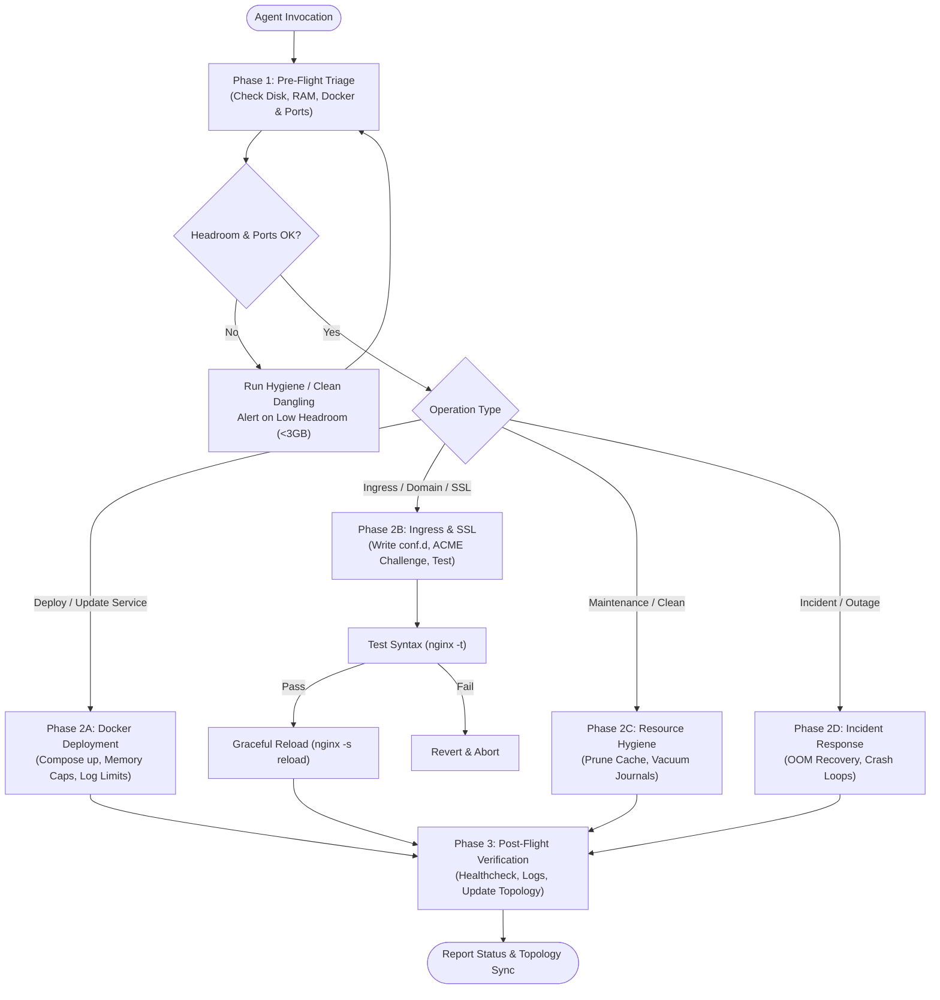

# DevOps Manager Master Runbook

An enterprise-grade, defensive operational engine for managing remote Linux servers, Dockerized microservices, ingress routing, and observability stacks.

---

## 🧭 Operational Decision Matrix

Every interaction with a managed server must follow a defensive three-phase lifecycle:



---

## ⚡ Quick Reference: Daily Operational Commands

| Workflow | Command / Procedure | Notes |
| :--- | :--- | :--- |
| **System Triage** | `powershell scripts/server-health-audit.ps1` | Probes CPU, RAM, Disk, Docker, and Open Ports |
| **Quick SSH Connect** | `ssh <profile-alias>` (e.g. `ssh hephaest`) | Configured via `~/.ssh/config` |
| **UI Tunneling** | `ssh -N <tunnel-alias>` (e.g. `ssh hephaest-tunnel`) | Forwards Dockhand (`:8008`), Prometheus (`:19090`) |
| **Check Docker State** | `docker ps --format "table {{.Names}}\t{{.Status}}\t{{.Ports}}"` | Container status overview |
| **Check Headroom** | `df -h / && free -h` | Mandatory pre/post deployment check |
| **Nginx Syntax Test** | `docker compose -f <nginx-compose> exec nginx nginx -t` | Dry-run syntax check before reload |
| **Graceful Nginx Reload** | `powershell scripts/safe-nginx-reload.ps1` | Zero-downtime hot reload |
| **Safe Docker Cleanup** | `powershell scripts/docker-cleanup.ps1` | Prunes dangling images & build cache (keeps volumes) |

---

## 📋 Standard Operating Procedures (SOP)

### SOP 1: Deploying or Updating a Service

1. **Verify Headroom**:
   ```bash
   df -h /
   free -h
   ```
   *Requirement*: Minimum **3.0 GB** free root disk space and sufficient free RAM/swap.
2. **Containerization Standard (Strict)**:
   - **Docker-Only**: Never run long-running daemons bare-metal on the host (`nohup`, `screen`, `systemd` apps).
   - **Service Directory**: Place services under `/home/ubuntu/<service-name>/` with isolated `docker-compose.yml` and `.env`.
   - **Explicit Container Name**: Must specify `container_name: <service-name>`.
   - **Restart Policy**: `restart: unless-stopped`.
   - **Resource Limits**: Always declare `mem_limit` (e.g. `mem_limit: 250m`).
   - **Log Rotation**: Always configure standard json-file logging:
     ```yaml
     logging:
       driver: "json-file"
       options:
         max-size: "10m"
         max-file: "3"
     ```
3. **Build & Deploy**:
   ```bash
   cd /home/ubuntu/<service-name>
   docker compose up -d --build
   ```
4. **Post-Deploy Verification**:
   - Inspect container logs: `docker compose logs --tail=50 <service>`
   - Verify container status in **Dockhand** (`http://127.0.0.1:8008`).
   - Re-check disk headroom (`df -h /`). If build cache was created, run `docker builder prune -f`.

---

### SOP 2: Adding or Updating a Domain / Reverse Proxy (Nginx)

1. **Create/Update Site Configuration**:
   Create `/home/ubuntu/nginx-proxy/conf.d/<subdomain.domain.tld>.conf`:
   ```nginx
   server {
       listen 80;
       server_name demo.example.com;

       # ACME challenge for Let's Encrypt renewal
       location /.well-known/acme-challenge/ {
           root /var/www/html;
       }

       location / {
           return 301 https://$host$request_uri;
       }
   }

   server {
       listen 443 ssl;
       server_name demo.example.com;

       ssl_certificate /etc/letsencrypt/live/demo.example.com/fullchain.pem;
       ssl_certificate_key /etc/letsencrypt/live/demo.example.com/privkey.pem;
       ssl_protocols TLSv1.2 TLSv1.3;
       ssl_ciphers HIGH:!aNULL:!MD5;

       location / {
           proxy_pass http://host.docker.internal:3050;
           proxy_http_version 1.1;
           proxy_set_header Upgrade $http_upgrade;
           proxy_set_header Connection 'upgrade';
           proxy_set_header Host $host;
           proxy_set_header X-Real-IP $remote_addr;
           proxy_set_header X-Forwarded-For $proxy_add_x_forwarded_for;
           proxy_set_header X-Forwarded-Proto $scheme;
           proxy_cache_bypass $http_upgrade;
       }
   }
   ```
2. **Mandatory Pre-Flight Syntax Check**:
   ```bash
   docker compose -f /home/ubuntu/nginx-proxy/docker-compose.yml exec nginx nginx -t
   ```
3. **Zero-Downtime Reload**:
   ```bash
   docker compose -f /home/ubuntu/nginx-proxy/docker-compose.yml exec nginx nginx -s reload
   ```
4. **Verify SSL & Response**:
   ```bash
   curl -k -Iv https://demo.example.com
   ```

---

### SOP 3: Resource & Disk Hygiene Protocol

To maintain continuous stability on storage- and memory-constrained VPS instances:

1. **Clean Dangling Images & Build Cache**:
   ```bash
   docker image prune -f
   docker builder prune -f
   ```
   *(Never use `docker system prune -a --volumes` without explicit human confirmation as it destroys database data)*.
2. **Vacuum Host Logs**:
   ```bash
   sudo journalctl --vacuum-time=7d
   sudo apt-get clean
   ```
3. **Identify Large Files or Log Runaways**:
   ```bash
   du -ah /var/lib/docker/containers 2>/dev/null | sort -rh | head -n 10
   ```

---

## 📚 Deep-Dive Reference Modules

- **[SSH & Connectivity](references/ssh-and-connectivity.md)**: Zero-leak SSH, custom ports, keypairs, bastion hosts & UI tunneling.
- **[Docker & Container Orchestration](references/docker-and-container-orchestration.md)**: Container standards, health checks, networking, memory capping.
- **[Reverse Proxy & SSL/TLS](references/reverse-proxy-and-ssl.md)**: Nginx gateway, `conf.d/` sites, Certbot ACME webroot, CDN edge SSL alignment.
- **[Resource & Disk Hygiene](references/resource-and-disk-hygiene.md)**: Headroom enforcement, safe prune, journal vacuum, log rotation.
- **[Observability & Health Checks](references/observability-and-health-checks.md)**: System triage matrix, Prometheus, Node Exporter, cAdvisor, Dockhand.
- **[Incident Playbooks & Recovery](references/incident-playbooks-and-recovery.md)**: OOM freezes, disk-full emergencies, port collisions, container crash loops.
- **[Safety Guardrails & Audit](references/safety-guardrails-and-audit.md)**: Prohibited destructive commands, pre-flight checks, topology documentation.

---

## 🛠️ Production Automation Scripts (`scripts/`)

- [`scripts/server-health-audit.ps1`](scripts/server-health-audit.ps1): Cross-platform multi-metric non-destructive health audit.
- [`scripts/safe-nginx-reload.ps1`](scripts/safe-nginx-reload.ps1): Validates syntax (`nginx -t`) inside container before initiating zero-downtime reload.
- [`scripts/docker-cleanup.ps1`](scripts/docker-cleanup.ps1): Safe cleanup of dangling images and build cache without data loss.
- [`scripts/server-ssh-tunnel.ps1`](scripts/server-ssh-tunnel.ps1): One-click local port forwarding for internal dashboards (Dockhand, Prometheus, Grafana).
