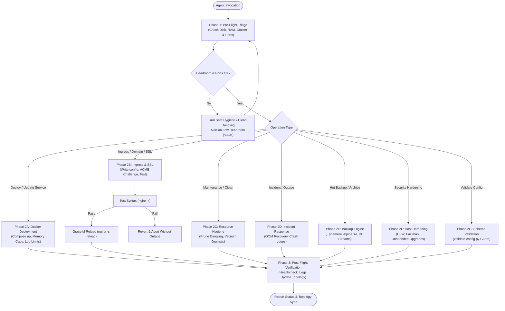

# DevOps Manager Master Runbook

An enterprise-grade, defensive operational engine for managing remote Linux servers, Dockerized microservices, ingress routing, backup pipelines, host hardening, and observability stacks.

---

## 🧭 Operational Decision Matrix

Every interaction with a managed server must follow a defensive three-phase lifecycle:


```mermaid
flowchart TD
    Start(["Agent Invocation"]) --> PreFlight["Phase 1: Pre-Flight Triage\n(Check Disk, RAM, Docker & Ports)"]
    PreFlight --> CheckOK{"Headroom & Ports OK?"}
    CheckOK -- No --> Remediate["Run Safe Hygiene / Clean Dangling\nAlert on Low Headroom (<3GB)"]
    Remediate --> PreFlight
    CheckOK -- Yes --> Action{"Operation Type"}
    
    Action -- "Deploy / Update Service" --> DeployFlow["Phase 2A: Docker Deployment\n(Compose up, Memory Caps, Log Limits)"]
    Action -- "Ingress / Domain / SSL" --> NginxFlow["Phase 2B: Ingress & SSL\n(Write conf.d, ACME Challenge, Test)"]
    Action -- "Maintenance / Clean" --> HygieneFlow["Phase 2C: Resource Hygiene\n(Prune Dangling, Vacuum Journals)"]
    Action -- "Incident / Outage" --> IncidentFlow["Phase 2D: Incident Response\n(OOM Recovery, Crash Loops)"]
    Action -- "Hot Backup / Archive" --> BackupFlow["Phase 2E: Backup Engine\n(Ephemeral Alpine :ro, DB Streams)"]
    Action -- "Security Hardening" --> HardeningFlow["Phase 2F: Host Hardening\n(UFW, Fail2ban, Unattended-Upgrades)"]
    Action -- "Validate Config" --> SchemaFlow["Phase 2G: Schema Validation\n(validate-config.py Guard)"]

    DeployFlow --> PostFlight["Phase 3: Post-Flight Verification\n(Healthcheck, Logs, Update Topology)"]
    NginxFlow --> NginxTest["Test Syntax (nginx -t)"]
    NginxTest -- Pass --> ReloadNginx["Graceful Reload (nginx -s reload)"]
    NginxTest -- Fail --> Abort["Revert & Abort Without Outage"]
    ReloadNginx --> PostFlight
    HygieneFlow --> PostFlight
    IncidentFlow --> PostFlight
    BackupFlow --> PostFlight
    HardeningFlow --> PostFlight
    SchemaFlow --> PostFlight
    PostFlight --> Finish(["Report Status & Topology Sync"])
```

---

## ⚡ Quick Reference: Dual-Engine Operational Commands

All operational tools are dual-engine, providing 100% parity between PowerShell 7+ (cross-platform Windows/macOS/Linux) and POSIX-compliant Bash:

| Operation | PowerShell 7+ (`scripts/*.ps1`) | POSIX Bash (`scripts/*.sh`) | Notes / Constraints |
| :--- | :--- | :--- | :--- |
| **System Triage** | `pwsh scripts/server-health-audit.ps1` | `bash scripts/server-health-audit.sh` | CPU, RAM, Disk, Docker status & open ports [INV-001] |
| **Nginx Syntax Test** | `pwsh scripts/safe-nginx-reload.ps1 -TestOnly` | `bash scripts/safe-nginx-reload.sh --test-only` | Pre-flight `nginx -t` validation without reload [INV-002] |
| **Nginx Graceful Reload** | `pwsh scripts/safe-nginx-reload.ps1` | `bash scripts/safe-nginx-reload.sh` | Zero-downtime hot reload (`nginx -s reload`) [INV-002] |
| **Safe Docker Cleanup** | `pwsh scripts/docker-cleanup.ps1` | `bash scripts/docker-cleanup.sh` | Prunes dangling images/builder cache; keeps volumes [NEG-001] |
| **UI Tunneling** | `pwsh scripts/server-ssh-tunnel.ps1` | `bash scripts/server-ssh-tunnel.sh` | Forwards Dockhand (`:8008`), Prometheus (`:19090`) |
| **Hot Volume Backup** | `pwsh scripts/backup-service.ps1 -VolumeName <vol>` | `bash scripts/backup-service.sh --volume <vol>` | Ephemeral Alpine `:ro` mount; zero downtime [INV-003] |
| **PostgreSQL Backup** | `pwsh scripts/backup-service.ps1 -DbType postgres -DbContainer <c> -DbUser <u> -DbName <d>` | `bash scripts/backup-service.sh --db-type postgres --db-container <c> --db-user <u> --db-name <d>` | Streaming `pg_dump` to `.sql.gz` [INV-003, NEG-003] |
| **MySQL Backup** | `pwsh scripts/backup-service.ps1 -DbType mysql -DbContainer <c> -DbUser <u> -DbName <d>` | `bash scripts/backup-service.sh --db-type mysql --db-container <c> --db-user <u> --db-name <d>` | Streaming `mysqldump` to `.sql.gz` [INV-003, NEG-003] |
| **Host Hardening** | *(Dispatched via SSH / Bash)* | `bash scripts/apply-security-hardening.sh` | UFW default-deny, Fail2ban, auto-patches [INV-004] |
| **Schema Validation** | `python scripts/validate-config.py` | `python3 scripts/validate-config.py` | Validates `config.json` against JSON Schema [INV-005] |

---

## 🎛️ Standard CLI Flags & Execution Parameters

Every operational script adheres to standard, uniform argument patterns across platforms:

| Flag (Bash) | Flag (PowerShell) | Description | Applicable Scripts |
| :--- | :--- | :--- | :--- |
| `-p, --profile <name>` | `-Profile <name>` | Selects a specific server profile from `config.json` | All scripts |
| `-c, --config <path>` | `-ConfigPath <path>` | Path to configuration file (default: `config.json`) | All scripts |
| `-d, --dry-run` | `-DryRun` | Simulates commands without executing destructive changes | All scripts [NEG-004] |
| `-t, --test-only` | `-TestOnly` / `-CheckOnly` | Executes pre-flight validation checks only and exits | Audit, Reload, Cleanup, Tunnel, Hardening |
| `-j, --json` | `-Json` | Formats output in structured JSON for automation & CI | All scripts |
| `-v, --volume <name>` | `-VolumeName <name>` | Target named Docker volume for hot archiving | `backup-service` |
| `--backup-dir <path>` | `-BackupDir <path>` | Directory where archives are stored (default: `/var/backups`) | `backup-service` |
| `--db-type <type>` | `-DbType <type>` | Database engine (`postgres` or `mysql`) | `backup-service` |
| `--db-container <name>` | `-DbContainer <name>` | Name of database container for exec dump | `backup-service` |
| `--db-user <name>` | `-DbUser <name>` | Database user for dump | `backup-service` |
| `--db-name <name>` | `-DbName <name>` | Target database name to dump | `backup-service` |
| `-s, --schema <path>` | *(Python CLI)* | Path to JSON schema file (default: `schemas/config.schema.json`) | `validate-config.py` |
| `-q, --quiet` | *(Python CLI)* | Suppresses stdout, returning exit code only (0=valid, 1=invalid) | `validate-config.py` |

---

## 📋 Standard Operating Procedures (SOP)

### SOP 1: Deploying or Updating a Service

1. **Verify Headroom**:
   ```bash
   df -h /
   free -h
   ```
   *Requirement*: Minimum **3.0 GB** free root disk space and sufficient free RAM/swap.
2. **Containerization Standard (Strict)**:
   - **Docker-Only**: Never run long-running daemons bare-metal on the host (`nohup`, `screen`, `systemd` apps) [NEG-002].
   - **Service Directory**: Place services under `/home/ubuntu/<service-name>/` with isolated `docker-compose.yml` and `.env`.
   - **Explicit Container Name**: Must specify `container_name: <service-name>`.
   - **Restart Policy**: `restart: unless-stopped`.
   - **Resource Limits**: Always declare `mem_limit` (e.g. `mem_limit: 250m`).
   - **Log Rotation**: Always configure standard json-file logging:
     ```yaml
     logging:
       driver: "json-file"
       options:
         max-size: "10m"
         max-file: "3"
     ```
3. **Build & Deploy**:
   ```bash
   cd /home/ubuntu/<service-name>
   docker compose up -d --build
   ```
4. **Post-Deploy Verification**:
   - Inspect container logs: `docker compose logs --tail=50 <service>`
   - Verify container status in **Dockhand** (`http://127.0.0.1:8008`).
   - Re-check disk headroom (`df -h /`). If build cache was created, run `docker builder prune -f`.

---

### SOP 2: Adding or Updating a Domain / Reverse Proxy (Nginx)

1. **Create/Update Site Configuration**:
   Create `/home/ubuntu/nginx-proxy/conf.d/<subdomain.domain.tld>.conf`:
   ```nginx
   server {
       listen 80;
       server_name demo.example.com;

       # ACME challenge for Let's Encrypt renewal
       location /.well-known/acme-challenge/ {
           root /var/www/html;
       }

       location / {
           return 301 https://$host$request_uri;
       }
   }

   server {
       listen 443 ssl;
       server_name demo.example.com;

       ssl_certificate /etc/letsencrypt/live/demo.example.com/fullchain.pem;
       ssl_certificate_key /etc/letsencrypt/live/demo.example.com/privkey.pem;
       ssl_protocols TLSv1.2 TLSv1.3;
       ssl_ciphers HIGH:!aNULL:!MD5;

       location / {
           proxy_pass http://host.docker.internal:3050;
           proxy_http_version 1.1;
           proxy_set_header Upgrade $http_upgrade;
           proxy_set_header Connection 'upgrade';
           proxy_set_header Host $host;
           proxy_set_header X-Real-IP $remote_addr;
           proxy_set_header X-Forwarded-For $proxy_add_x_forwarded_for;
           proxy_set_header X-Forwarded-Proto $scheme;
           proxy_cache_bypass $http_upgrade;
       }
   }
   ```
2. **Mandatory Pre-Flight Syntax Check**:
   ```bash
   # Using Safe Nginx Reload CLI
   bash scripts/safe-nginx-reload.sh --test-only
   # Or directly inside container
   docker compose -f /home/ubuntu/nginx-proxy/docker-compose.yml exec nginx nginx -t
   ```
3. **Zero-Downtime Reload**:
   ```bash
   bash scripts/safe-nginx-reload.sh
   ```
4. **Verify SSL & Response**:
   ```bash
   curl -k -Iv https://demo.example.com
   ```

---

### SOP 3: Resource & Disk Hygiene Protocol

To maintain continuous stability on storage- and memory-constrained VPS instances:

1. **Clean Dangling Images & Build Cache**:
   ```bash
   # Cross-platform CLI runner
   bash scripts/docker-cleanup.sh
   # Or PowerShell runner
   pwsh scripts/docker-cleanup.ps1
   ```
   *(Never use `docker system prune -a --volumes` as it destroys database data [NEG-001])*.
2. **Vacuum Host Logs**:
   ```bash
   sudo journalctl --vacuum-time=7d
   sudo apt-get clean
   ```
3. **Identify Large Files or Log Runaways**:
   ```bash
   du -ah /var/lib/docker/containers 2>/dev/null | sort -rh | head -n 10
   ```

---

### SOP 4: Hot Volume & Streaming Database Backups (Zero Downtime)

1. **Hot Volume Backup (Zero Downtime)**:
   ```bash
   bash scripts/backup-service.sh --volume postgres_data --backup-dir /var/backups
   ```
   *Safety*: Mounts volume read-only (`:ro`) in ephemeral Alpine container; creates timestamped `.tar.gz`. Persistent volumes are NEVER pruned [NEG-001].
2. **Streaming Database Backup**:
   ```bash
   # PostgreSQL
   bash scripts/backup-service.sh --db-type postgres --db-container pg-server --db-user postgres --db-name appdb
   # MySQL
   bash scripts/backup-service.sh --db-type mysql --db-container mysql-server --db-user root --db-name shopdb
   ```
   *Secrets*: Credentials resolved via environment variables or CLI flags [NEG-003].
3. **Dual-Tier Retention Rotation**:
   Executes automated rotation keeping the most recent 7 daily backups and 4 weekly backups. Archives older than 28 days are safely pruned without touching volumes or databases.

---

### SOP 5: Disaster Recovery & Point-in-Time Restoration

1. **Scenario A: Restoring a Docker Volume from Archive**:
   ```bash
   # 1. Stop the application container to prevent write conflicts
   docker stop <container_name>

   # 2. Extract backup tarball into target volume using ephemeral Alpine container
   docker run --rm \
     -v "<volume_name>:/target" \
     -v "/var/backups:/backup:ro" \
     alpine sh -c "cd /target && rm -rf ./* && tar xzf /backup/<archive_name>.tar.gz -C /target"

   # 3. Restart application and verify health
   docker start <container_name>
   docker logs --tail=50 <container_name>
   ```

2. **Scenario B: Restoring a PostgreSQL Database Dump**:
   ```bash
   gunzip -c /var/backups/<archive_name>.sql.gz | docker exec -i <container_name> psql -U <user> -d <db_name>
   ```

3. **Scenario C: Restoring a MySQL Database Dump**:
   ```bash
   gunzip -c /var/backups/<archive_name>.sql.gz | docker exec -i <container_name> mysql -u <user> -p"<password>" <db_name>
   ```

4. **Post-Restoration Verification**:
   - Verify database row counts or schema integrity.
   - Run `bash scripts/server-health-audit.sh` to confirm service health.

---

### SOP 6: Host & Perimeter Security Hardening (UFW, Fail2ban, Unattended-Upgrades)

1. **Pre-Flight Lockout Audit & Dry-Run Simulation**:
   ```bash
   # Simulate hardening policies without altering host rules [NEG-004]
   bash scripts/apply-security-hardening.sh --dry-run
   # Or run pre-flight connectivity check only
   bash scripts/apply-security-hardening.sh --test-only
   ```
2. **Apply Baseline Edge & Host Hardening**:
   ```bash
   bash scripts/apply-security-hardening.sh --profile hephaest
   ```
   *Policies Enforced*:
   - **UFW Firewall**: Default-deny incoming, default-allow outgoing, dynamically allows profile SSH port (e.g. `2222`), HTTP (`80`), HTTPS (`443`), and Docker bridge interface (`docker0`) [INV-004].
   - **Fail2ban**: Deploys `jail.local` with hardened `[sshd]` (`maxretry: 5`, `bantime: 1h`) and `[nginx-req-limit]` jails.
   - **Unattended-Upgrades**: Configures daily non-interactive security patch updates.
3. **Kernel Network Stack Hardening (`sysctl`)**:
   Deploy sysctl hardening profile to `/etc/sysctl.d/99-security-hardening.conf` (SYN cookie protection, reverse path filtering, ICMP broadcast ignore) and apply via `sudo sysctl --system`.

---

### SOP 7: Strict Configuration Schema Validation & Integrity Guard

1. **Validate Repository Configuration**:
   ```bash
   python scripts/validate-config.py --config config.json
   ```
2. **Validate Configuration Template**:
   ```bash
   python scripts/validate-config.py --config config.template.json
   ```
3. **Structured JSON Output for CI/CD Gates**:
   ```bash
   python scripts/validate-config.py --config config.json --json
   ```
   *Guarantees*: All profile fields (`name`, `host`, `port`, `user`, `services`, `thresholds`, `monitoring`) conform strictly to JSON Schema Draft 2020-12 [INV-005].

---

## 📚 Deep-Dive Reference Modules

- **[SSH & Connectivity](references/ssh-and-connectivity.md)**: Zero-leak SSH, custom ports, keypairs, bastion hosts & UI tunneling.
- **[Docker & Container Orchestration](references/docker-and-container-orchestration.md)**: Container standards, health checks, networking, memory capping.
- **[Reverse Proxy & SSL/TLS](references/reverse-proxy-and-ssl.md)**: Nginx gateway, `conf.d/` sites, Certbot ACME webroot, CDN edge SSL alignment.
- **[Resource & Disk Hygiene](references/resource-and-disk-hygiene.md)**: Headroom enforcement, safe prune, journal vacuum, log rotation.
- **[Observability & Health Checks](references/observability-and-health-checks.md)**: System triage matrix, Prometheus, Node Exporter, cAdvisor, Dockhand.
- **[Incident Playbooks & Recovery](references/incident-playbooks-and-recovery.md)**: OOM freezes, disk-full emergencies, port collisions, container crash loops.
- **[Backup & Disaster Recovery](references/backup-and-disaster-recovery.md)**: Hot volume backups, streaming database dumps, daily/weekly retention rotation, and disaster recovery playbooks.
- **[Firewall & Host Hardening](references/firewall-and-host-hardening.md)**: UFW firewall baseline, Fail2ban intrusion prevention, unattended-upgrades, and sysctl network hardening.
- **[Safety Guardrails & Audit](references/safety-guardrails-and-audit.md)**: Prohibited destructive commands, pre-flight checks, topology documentation.

---

## 🛠️ Production Automation Scripts (`scripts/`)

- [`scripts/server-health-audit.ps1`](scripts/server-health-audit.ps1) / [`scripts/server-health-audit.sh`](scripts/server-health-audit.sh): Cross-platform multi-metric non-destructive health audit.
- [`scripts/safe-nginx-reload.ps1`](scripts/safe-nginx-reload.ps1) / [`scripts/safe-nginx-reload.sh`](scripts/safe-nginx-reload.sh): Validates syntax (`nginx -t`) inside container before initiating zero-downtime reload.
- [`scripts/docker-cleanup.ps1`](scripts/docker-cleanup.ps1) / [`scripts/docker-cleanup.sh`](scripts/docker-cleanup.sh): Safe cleanup of dangling images and build cache without data loss.
- [`scripts/backup-service.ps1`](scripts/backup-service.ps1) / [`scripts/backup-service.sh`](scripts/backup-service.sh): Safe non-destructive hot volume & database streaming backups with dual-tier retention rotation.
- [`scripts/server-ssh-tunnel.ps1`](scripts/server-ssh-tunnel.ps1) / [`scripts/server-ssh-tunnel.sh`](scripts/server-ssh-tunnel.sh): One-click local port forwarding for internal dashboards (Dockhand, Prometheus, Grafana).
- [`scripts/apply-security-hardening.sh`](scripts/apply-security-hardening.sh): Applies UFW firewall, Fail2ban jails, and unattended-upgrades with dry-run and lockout prevention.
- [`scripts/validate-config.py`](scripts/validate-config.py): Strict schema validation CLI verifying `config.json` against JSON Schema Draft 2020-12.
