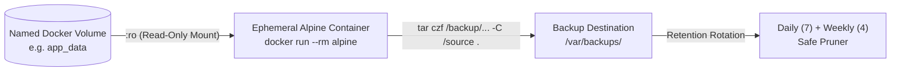

# Backup & Disaster Recovery Runbook

An enterprise-grade, defensive guide for automated zero-downtime hot backups, database streaming dumps, retention rotation, and disaster recovery procedures.

---

## 🛡️ Core Principles & Invariants

1. **[INV-003] Automated Backup & Disaster Recovery**:
   - Zero-downtime hot backup of named Docker volumes using ephemeral Alpine containers mounted read-only (`:ro`).
   - Direct streaming database dumps for PostgreSQL (`pg_dump`) and MySQL (`mysqldump`) into compressed `.sql.gz` archives.
   - Dual-tier retention policy: 7 daily backups and 4 weekly backups.
2. **[NEG-001] Zero Destructive Pruning**:
   - Backup engines and rotation policies MUST NEVER remove, prune, or alter persistent Docker volumes.
   - All retention pruning operates strictly on regular files (`-type f -maxdepth 1`) matching dedicated archive patterns (`*.tar.gz`, `*.sql.gz`).
3. **[NEG-003] Zero Hardcoded Secrets**:
   - Database credentials and tokens are dynamically resolved via CLI flags or standard environment variables (`DB_USER`, `DB_NAME`, `DB_PASS`, `POSTGRES_USER`, `POSTGRES_DB`, `PGPASSWORD`, `MYSQL_USER`, `MYSQL_DATABASE`, `MYSQL_PWD`).

---

## 📦 Architecture: Ephemeral Alpine Volume Backup

Instead of stopping running application containers, the backup engine attaches an ephemeral Alpine container directly to the target volume in read-only mode (`:ro`):



### Exact Command Pattern:
```bash
docker run --rm \
  -v "${volume}:/source:ro" \
  -v "${backup_dir}:/backup" \
  alpine tar czf "/backup/${volume}_${timestamp}.tar.gz" -C /source .
```

- **Zero Downtime**: The production container continues serving traffic without interruption.
- **Data Safety**: Mount is strictly read-only (`:ro`), preventing any write corruption during archiving.
- **Zero Host Pollution**: The Alpine container is automatically removed immediately after creation (`--rm`).

---

## 🗄️ Database Dump Orchestration

For transactional integrity, stateful database services can be dumped in-stream without intermediary uncompressed disk writes:

### 1. PostgreSQL Streaming Dump
```bash
# Streaming pg_dump via docker exec into gzip
docker exec -i ${container} pg_dump -U ${user} ${db} | gzip > "${backup_dir}/${container}_${db}_${timestamp}.sql.gz"
```
*Authentication*: Handled via `PGPASSWORD` environment variable or `--db-pass` flag. If `.pgpass` or local trust authentication is configured within the container, no password is required.

### 2. MySQL Streaming Dump
```bash
# Streaming mysqldump via docker exec into gzip
docker exec -i ${container} mysqldump -u ${user} -p"${pass}" ${db} | gzip > "${backup_dir}/${container}_${db}_${timestamp}.sql.gz"
```
*Authentication*: Handled via `MYSQL_PWD` / `MYSQL_ROOT_PASSWORD` environment variable or `--db-pass` flag.

---

## 🔄 Dual-Tier Retention Rotation Policy

The retention policy enforces a predictable storage ceiling while maintaining deep recovery points:
- **Daily Retention**: Keeps the most recent 7 daily backups.
- **Weekly Retention**: Keeps the most recent 4 weekly backups (one snapshot per week for the preceding 4 weeks).
- **Pruning Safety**:
  - Archives older than 28 days (4 weeks) are pruned.
  - Archives older than 7 days that are not weekly backups are pruned.
  - Active volumes, config files, and other services in `/var/backups` are untouched.

---

## 🚀 CLI Automation Usage

### POSIX / Bash (`scripts/backup-service.sh`)
```bash
# 1. Hot backup of named Docker volume
bash scripts/backup-service.sh --volume postgres_data --backup-dir /var/backups

# 2. PostgreSQL streaming dump
bash scripts/backup-service.sh --db-type postgres --db-container pg-server --db-user postgres --db-name appdb

# 3. MySQL streaming dump
bash scripts/backup-service.sh --db-type mysql --db-container mysql-server --db-user root --db-name shopdb

# 4. Dry-run simulation (contract testing)
bash scripts/backup-service.sh --service webapp --dry-run

# 5. Structured JSON output for monitoring & CI
bash scripts/backup-service.sh --service webapp --json
```

### PowerShell (`scripts/backup-service.ps1`)
```powershell
# 1. Hot backup of named Docker volume
.\scripts\backup-service.ps1 -VolumeName "webapp_data" -BackupDir "/var/backups"

# 2. Database dump with custom retention
.\scripts\backup-service.ps1 -DbType "postgres" -DbContainer "db-service" -DbUser "admin" -DbName "prod" -RetentionDaily 7 -RetentionWeekly 4

# 3. Dry-run verification
.\scripts\backup-service.ps1 -ServiceName "nginx-proxy" -DryRun
```

---

## 🚨 Disaster Recovery & Restoration Procedures

### Scenario A: Restoring a Docker Volume from Archive
1. **Stop the Application Container**:
   ```bash
   docker stop <container_name>
   ```
2. **Restore Volume from Compressed Tarball**:
   ```bash
   docker run --rm \
     -v "<volume_name>:/target" \
     -v "/var/backups:/backup:ro" \
     alpine sh -c "cd /target && rm -rf ./* && tar xzf /backup/<archive_name>.tar.gz -C /target"
   ```
3. **Restart the Application**:
   ```bash
   docker start <container_name>
   docker logs --tail=50 <container_name>
   ```

### Scenario B: Restoring a PostgreSQL Database
```bash
gunzip -c /var/backups/<archive_name>.sql.gz | docker exec -i <container_name> psql -U <user> -d <db_name>
```

### Scenario C: Restoring a MySQL Database
```bash
gunzip -c /var/backups/<archive_name>.sql.gz | docker exec -i <container_name> mysql -u <user> -p"<password>" <db_name>
```
