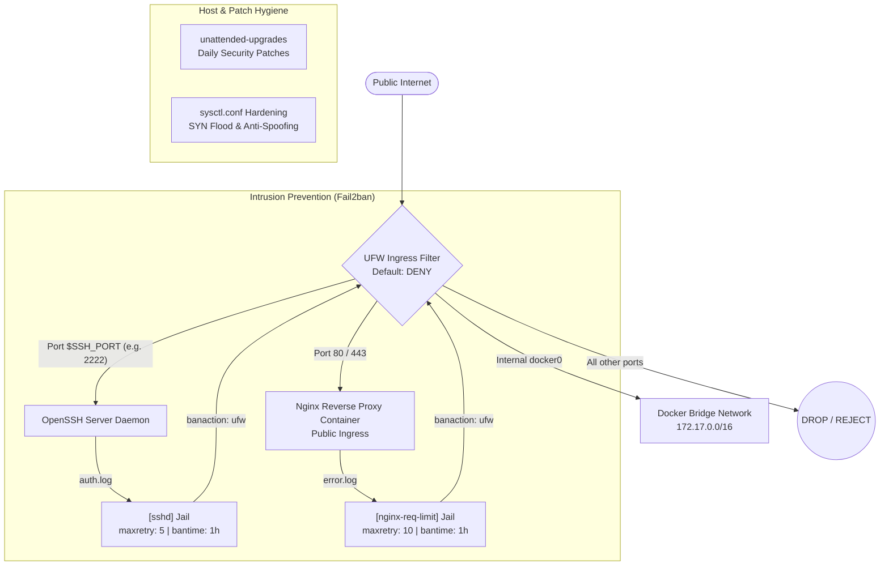

# Host & Edge Security Hardening Runbook

An enterprise-grade SRE operational guide for Linux firewall orchestration, intrusion prevention, automated patch management, and kernel network hardening.

---

## 🛡️ Core Principles & Invariants

1. **[INV-004] Host & Edge Hardening Module**:
   - Baseline edge perimeter enforcement using Uncomplicated Firewall (UFW) with strict default-deny policies.
   - Dynamic SSH port ingress filtering to prevent lockout scenarios while mitigating brute-force vectors.
   - Docker bridge interface (`docker0`) traffic preservation and explicit isolation of forwarded container ports.
   - Automated intrusion prevention using Fail2ban with rate-limiting and jail definitions for SSH and Nginx.
   - Continuous daily OS security patching through `unattended-upgrades`.
   - Kernel-level network stack hardening via `sysctl` for SYN flood resistance, anti-spoofing, and ICMP mitigation.
2. **[NEG-002] Clean Daemons**:
   - Security configurations leverage standard native distribution daemons (`ufw`, `fail2ban`, `unattended-upgrades`, `systemd-sysctl`). No custom unmanaged daemon binaries or ad-hoc background scripts.
3. **[NEG-003] Zero Hardcoded Secrets**:
   - Firewall rules, jail definitions, and automation scripts contain zero hardcoded credentials, API keys, or private IP reservations.
4. **[NEG-004] Zero Breaking Changes**:
   - Changes are staged with pre-flight connection checks, pre-commit validation, and support dry-run simulation mode.

---

## 🧱 Ingress & Perimeter Architecture



---

## 1. UFW Firewall Baseline & Best Practices

Uncomplicated Firewall (UFW) serves as the front-line packet filter on Debian and Ubuntu hosts.

### 1.1 Baseline Policy Configuration
Production environments must enforce an explicit default-deny posture on all ingress traffic while permitting outbound connections:

```bash
# Default policies
sudo ufw default deny incoming
sudo ufw default allow outgoing
sudo ufw default deny routed
```

### 1.2 Ingress Rules & SSH Lockout Prevention
Before enabling UFW, required management and ingress ports must be opened. If the SSH daemon runs on a non-standard port (e.g., `2222`), that port **must** be opened first:

```bash
# Allow configured SSH port (dynamically read from profile)
sudo ufw allow ${SSH_PORT}/tcp comment 'SSH Ingress'

# Allow web ingress
sudo ufw allow 80/tcp comment 'HTTP Web Ingress'
sudo ufw allow 443/tcp comment 'HTTPS Web Ingress'

# Allow local Docker bridge communication
sudo ufw allow in on docker0 comment 'Docker bridge traffic'

# Enable firewall without interactive prompt
sudo ufw --force enable
```

### 1.3 Docker and UFW Interaction Pitfall
By default, Docker manipulates `iptables` directly by injecting `PREROUTING` and `DOCKER` rules into the NAT table. This causes Docker to publish container ports (e.g., `-p 8080:8080`) **before** UFW's `INPUT` filter chain is evaluated, exposing internal services to the public internet even when UFW is set to default deny.

#### Remediation Strategies:
1. **Localhost Binding (Mandatory in Compose)**:
   In `docker-compose.yml`, always bind backend containers exclusively to the local loopback interface:
   ```yaml
   ports:
     - "127.0.0.1:8008:8008"   # Exposed only to host / local reverse proxy
   ```
2. **UFW Forward Policy**:
   Verify `/etc/default/ufw` sets the forward policy:
   ```ini
   DEFAULT_FORWARD_POLICY="ACCEPT"
   ```
3. **Explicit Bridge Rules**:
   Allow traffic originating from the Docker bridge interface:
   ```bash
   sudo ufw allow in on docker0
   ```
4. **DOCKER-USER Chain Protection**:
   For advanced scenarios where raw Docker ports must be filtered at the host level, insert rules into the `DOCKER-USER` chain before Docker's forwarding rules execute:
   ```bash
   iptables -I DOCKER-USER -i eth0 ! -s 10.0.0.0/8 -p tcp -m tcp --dport 8080 -j DROP
   ```

---

## 2. Fail2ban Intrusion Prevention System

Fail2ban monitors system and application log files for authentication failures, malicious scanning, or rate limit violations, dynamically inserting temporary ban rules into UFW.

### 2.1 SSH Brute-Force Jail (`[sshd]`)
Configure `/etc/fail2ban/jail.local` with strict brute-force thresholds:

```ini
[DEFAULT]
bantime  = 1h
findtime = 10m
maxretry = 5
banaction = ufw
ignoreip = 127.0.0.1/8 ::1

[sshd]
enabled  = true
port     = ssh
filter   = sshd
logpath  = /var/log/auth.log
backend  = systemd
maxretry = 5
findtime = 10m
bantime  = 1h
banaction = ufw
```

*Note*: If SSH runs on a custom port, replace `port = ssh` with `port = <ssh_port>`.

### 2.2 Nginx Rate-Limiting Jail (`[nginx-req-limit]`)
When Nginx `limit_req` is configured to protect against DoS and credential stuffing, Nginx writes excess request events to its error log. Fail2ban captures these events and drops the offending IP address:

```ini
[nginx-req-limit]
enabled  = true
filter   = nginx-limit-req
logpath  = /var/log/nginx/*error.log
maxretry = 10
findtime = 10m
bantime  = 1h
banaction = ufw
```

### 2.3 Bad Bot & Vulnerability Scanner Jail (`[nginx-botsearch]`)
Blocks automated vulnerability scanners probing for known exploits (`.env`, `wp-login.php`, `phpmyadmin`, `.git/`):

```ini
[nginx-botsearch]
enabled  = true
filter   = nginx-botsearch
logpath  = /var/log/nginx/*error.log
maxretry = 3
findtime = 10m
bantime  = 24h
banaction = ufw
```

### 2.4 Operational Verification
```bash
# Check Fail2ban service status
sudo systemctl status fail2ban

# View active jails and ban counts
sudo fail2ban-client status
sudo fail2ban-client status sshd
sudo fail2ban-client status nginx-req-limit

# Unban an IP address if needed
sudo fail2ban-client set sshd unbanip 203.0.113.42
```

---

## 3. Automated Security Patches (`unattended-upgrades`)

Automatic security patch installation ensures zero-day vulnerabilities in OS libraries and packages (OpenSSL, OpenSSH, libc, kernel) are mitigated promptly without requiring manual maintenance intervention.

### 3.1 Package Installation
```bash
sudo apt-get update
sudo apt-get install -y unattended-upgrades update-notifier-common
```

### 3.2 Configuration: `/etc/apt/apt.conf.d/50unattended-upgrades`
Restrict updates strictly to verified security repositories, auto-remove obsolete dependencies, and disable uncoordinated reboots:

```text
Unattended-Upgrade::Allowed-Origins {
    "${distro_id}:${distro_codename}-security";
    "${distro_id}ESMApps:${distro_codename}-apps-security";
    "${distro_id}ESM:${distro_codename}-infra-security";
};

Unattended-Upgrade::Package-Blacklist {
    // Pin database engines to prevent unexpected major-version migrations
    // "postgresql";
    // "mysql-server";
};

Unattended-Upgrade::AutoFixInterruptedDpkg "true";
Unattended-Upgrade::MinimalSteps "true";
Unattended-Upgrade::InstallOnShutdown "false";
Unattended-Upgrade::Remove-Unused-Kernel-Packages "true";
Unattended-Upgrade::Remove-New-Unused-Dependencies "true";
Unattended-Upgrade::Automatic-Reboot "false";
Unattended-Upgrade::SyslogEnable "true";
```

### 3.3 Periodic Automation: `/etc/apt/apt.conf.d/20auto-upgrades`
Enable daily automated update sweeps:

```text
APT::Periodic::Update-Package-Lists "1";
APT::Periodic::Download-Upgradeable-Packages "1";
APT::Periodic::AutocleanInterval "7";
APT::Periodic::Unattended-Upgrade "1";
```

### 3.4 Verification
```bash
# Perform dry-run upgrade test
sudo unattended-upgrades --dry-run --debug
```

---

## 4. Sysctl Network Hardening & Port Scan Defenses

Kernel network tuning protects the operating system against SYN flood denial-of-service, IP spoofing, packet redirects, and low-footprint port scans.

### 4.1 Production Sysctl Profile: `/etc/sysctl.d/99-security-hardening.conf`

```ini
# ==============================================================================
# Linux Kernel Network Security Hardening Profile
# ==============================================================================

# TCP SYN Flood Protection
net.ipv4.tcp_syncookies = 1
net.ipv4.tcp_max_syn_backlog = 4096
net.ipv4.tcp_synack_retries = 2

# IP Spoofing Verification (Reverse Path Filtering)
net.ipv4.conf.all.rp_filter = 1
net.ipv4.conf.default.rp_filter = 1

# Ignore ICMP Echo Broadcasts (Smurf Attack Mitigation)
net.ipv4.icmp_echo_ignore_broadcasts = 1

# Ignore Bogus ICMP Error Responses
net.ipv4.icmp_ignore_bogus_error_responses = 1

# Disable ICMP Redirect Acceptance (Prevents MITM Routing Hijacking)
net.ipv4.conf.all.accept_redirects = 0
net.ipv4.conf.default.accept_redirects = 0
net.ipv4.conf.all.send_redirects = 0
net.ipv4.conf.default.send_redirects = 0

# Disable Source Packet Routing
net.ipv4.conf.all.accept_source_route = 0
net.ipv4.conf.default.accept_source_route = 0

# Log Suspicious (Martian) Packets
net.ipv4.conf.all.log_martians = 1
net.ipv4.conf.default.log_martians = 1

# TCP Keepalive & Resource Hygiene
net.ipv4.tcp_fin_timeout = 30
net.ipv4.tcp_keepalive_time = 300
net.ipv4.tcp_keepalive_probes = 5
net.ipv4.tcp_keepalive_intvl = 15

# IPv6 Protections (if enabled)
net.ipv6.conf.all.accept_redirects = 0
net.ipv6.conf.default.accept_redirects = 0
net.ipv6.conf.all.accept_source_route = 0
net.ipv6.conf.default.accept_source_route = 0
```

### 4.2 Applying Kernel Parameters
```bash
sudo sysctl --system
```

### 4.3 Port Scanning & Reconnaissance Defense
In addition to kernel parameter tuning:
1. **UFW SSH Rate-Limiting**:
   ```bash
   sudo ufw limit ${SSH_PORT}/tcp comment 'Rate-limit SSH connections'
   ```
   Limits attempts from an IP generating more than 6 connections within 30 seconds.
2. **Invalid Packet Dropping**:
   Add to `/etc/ufw/before.rules` under `*filter`:
   ```text
   -A ufw-before-input -m conntrack --ctstate INVALID -j DROP
   ```

---

## 5. Pre-Flight Verification & Lockout Prevention Checklist

| Phase | Check Item | Validation Command | Acceptance Criteria |
| :--- | :--- | :--- | :--- |
| **Pre-Flight** | SSH Connectivity | `ssh -p $SSH_PORT user@host "echo OK"` | Must exit 0 before touching firewall |
| **Pre-Flight** | Open Ports Audit | `ss -tulpn` | Confirm listening ports and bindings |
| **Staging** | Dry-Run Execution | `apply-security-hardening.sh --dry-run` | Review exact commands and rule diffs |
| **Execution** | UFW Configuration | `sudo ufw status numbered` | Confirm default deny + port rules present |
| **Execution** | Fail2ban Verification | `sudo fail2ban-client ping` | Returns `Server replied: pong` |
| **Execution** | Unattended Upgrades | `sudo unattended-upgrades --dry-run` | Confirms upgrade origin parsing |
| **Post-Flight** | Active SSH Session | Open a secondary terminal | Secondary connection connects immediately |
